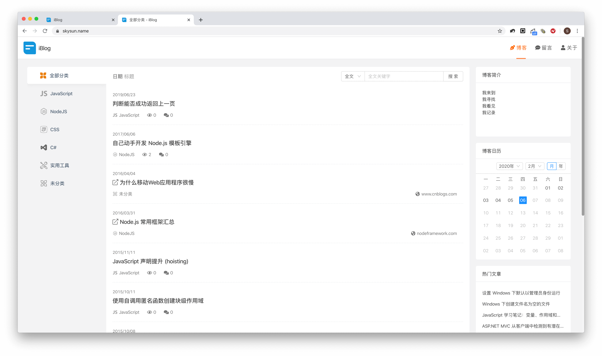
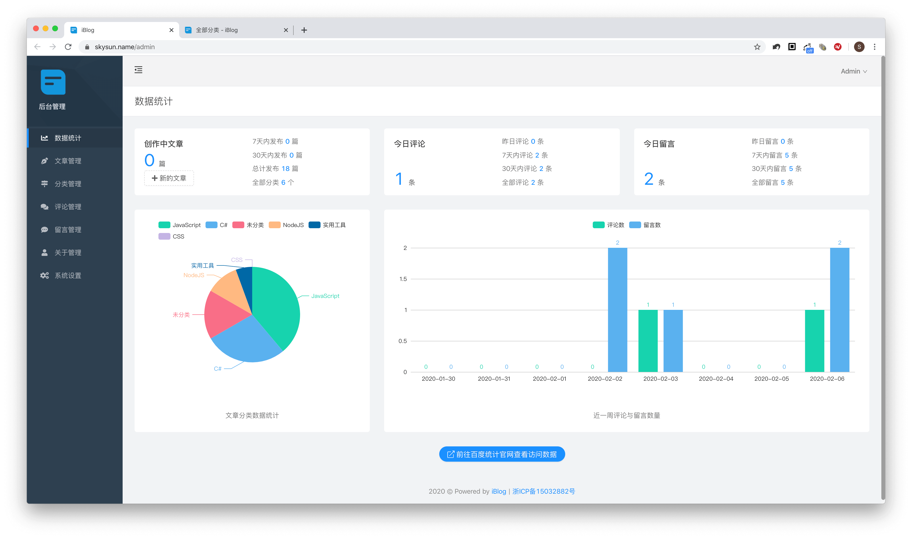
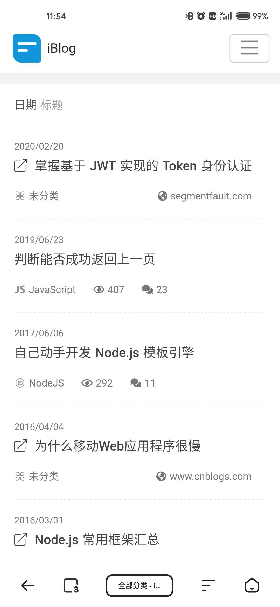
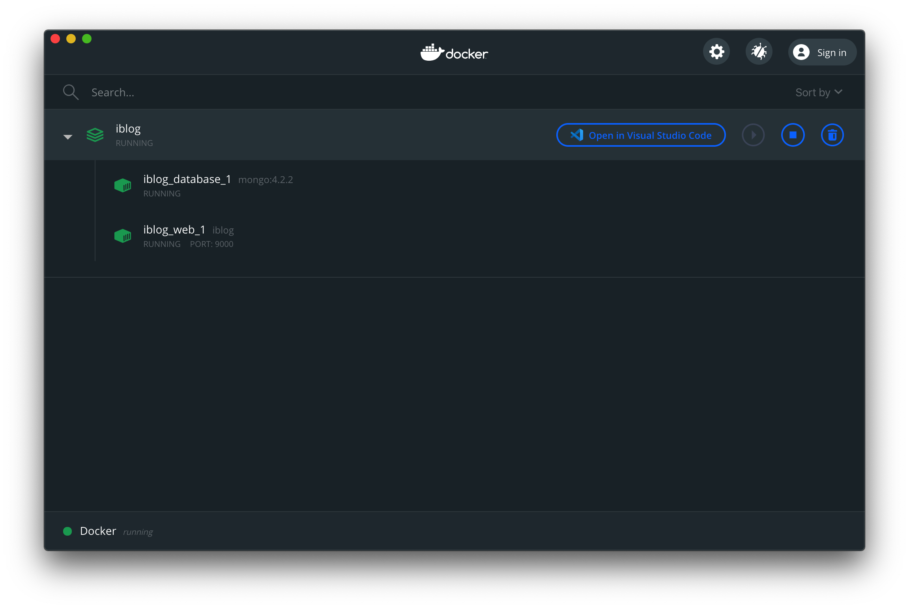

# iBlog
基于 Node.js 的开源个人博客系统，现代化的 UI 和用户体验。支持桌面端和移动端访问，支持深色模式，支持 [Docker](https://www.docker.com/) 部署。  
**不仅仅是博客，更是 Demo**，是适合新人入门学习的完整项目。

## 目录
- [界面预览](#界面预览)
- [在线实例](#在线实例)
- [分支说明](#分支说明)
- [技术构成](#技术构成)
- [快速开始](#快速开始)
  * [准备条件](#准备条件)
  * [安装依赖](#安装依赖)
  * [启动站点](#启动站点)
  * [Debug](#debug)
- [系统设置](#系统设置)
- [线上部署](#线上部署)
  * [使用PM2](#使用pm2)
  * [使用noginx](#使用noginx)
- [Docker](#docker)
  * [安装Docker](#安装docker)
  * [制作镜像](#制作镜像)
  * [创建容器](#创建容器)
  * [容器管理](#容器管理)
- [更新日志](#更新日志)
- [TODO](#todo)
- [许可协议](#许可协议)

## 界面预览
* 博客首页

* 后台管理

* 移动端


## 在线实例
我的博客 [https://skysun.name/](https://skysun.name/)

## 分支说明
* 当前分支 (v2.0.0) 基于 [TypeScript](https://www.typescriptlang.org/) + [NuxtJS](https://nuxtjs.org/)
* [v1.0.0](https://github.com/eshengsky/iBlog/tree/v1.0.0) 分支基于 JavaScript + [ExpressJS](https://expressjs.com/)
* [iBlog.Net](https://github.com/eshengsky/iBlog.Net) 基于 C# + [ASP.NET](https://dotnet.microsoft.com/apps/aspnet)

## 技术构成
* 开发语言 [TypeScript](https://www.typescriptlang.org/)
* 服务端 [Node.js](https://nodejs.org/)
* SSR框架 [NuxtJS](https://nuxtjs.org/)
* 前端框架 [Vue](https://vuejs.org/)
* 组件库 [Ant Design of Vue](https://www.antdv.com/docs/vue/introduce-cn/)
* Web字体 [Font Awesome](https://fontawesome.com/)
* 持久化 [MongoDB](https://www.mongodb.org/)
* 身份验证 [@nuxtjs/auth](https://auth.nuxtjs.org/)

## 快速开始

### 准备条件

安装 [Node.js](https://nodejs.org/en/download/) (v8 以上版本)、[MongoDB](https://www.mongodb.org/downloads/)。  
推荐安装 [Yarn](https://yarnpkg.com/) 而非 npm 以进行包管理。

### 安装依赖
```Shell
$ yarn
```

### 启动站点

* 开发模式

```Shell
$ yarn run dev
```

* 生产模式

先编译项目
```shell
$ yarn run build
```

再启动站点
```shell
$ yarn start
```

打开浏览器，访问 [http://localhost:9000/](http://localhost:9000)

### Debug
* 要启动前端代码调试，请直接在 Chrome Dev Tools - Sources 面板中进行。

* 要启动服务端代码调试，请以如下命令启动服务，然后点击 Chrome  Dev Tools 左上角的 Node.js 按钮，就可以像调试前端代码一样调试服务端了。

```shell
$ node --inspect node_modules/.bin/nuxt-ts
```


#### Enjoy it! :smile:

## 系统设置

根据实际情况修改 `/blog.config.ts` 配置文件，修改后需要重启服务器才能生效。  
参数说明：

#### host
`String` 类型，主机名，配置为 `0.0.0.0` 表示监听任意主机。

#### port
`Number` 类型，端口号。

#### enableHTTPS
`Boolean` 类型，是否启用 HTTPS。

#### mongoUrl
`String` 类型，MongoDB 链接。

#### jwtSecret
`String` 类型，[JWT](https://github.com/auth0/node-jsonwebtoken) 秘钥。

## 线上部署

### 使用PM2
推荐使用 [pm2](https://pm2.keymetrics.io/) 进行 Node.js 的进程管理和持久运行。

#### 安装
```Shell
$ yarn global add pm2
```
#### 启动
```Shell
$ pm2 start pm2.json
```

### 使用noginx
[noginx](https://github.com/eshengsky/noginx) 是基于 Node.js 的 HTTP 及反向代理服务器（类似 nginx），如果你有多台 iBlog 服务器实例，你可以使用 [noginx](https://github.com/eshengsky/noginx) 进行代理转发和负载均衡。

## Docker

iBlog 支持使用 [Docker](https://www.docker.com/) 容器快速部署并启动项目。

### 安装Docker

在 [官方下载页面](https://www.docker.com/get-started) 选择对应平台的 Docker Desktop 下载并安装。

### 制作镜像

在项目根目录下执行如下命令创建镜像文件：
```Shell
$ yarn run dockerImage
```

如果创建成功，你可以使用如下命令查看到生成的镜像：
```Shell
$ docker image ls
```

### 创建容器

执行如下命令创建容器：
```Shell
$ yarn run dockerRun
```

### 容器管理

通过 Docker Desktop 执行启动、停止、查看日志等操作。


## 更新日志

请直接查看 [Commit](https://github.com/eshengsky/iBlog/commits/master) 记录。

## [TODO](./TODO.md)

项目的后续更新计划，欢迎提交 [PR](https://github.com/eshengsky/iBlog/pulls)。

## 许可协议
MIT License

Copyright (c) 2020 Sky.Sun 孙正华

Permission is hereby granted, free of charge, to any person obtaining a copy
of this software and associated documentation files (the "Software"), to deal
in the Software without restriction, including without limitation the rights
to use, copy, modify, merge, publish, distribute, sublicense, and/or sell
copies of the Software, and to permit persons to whom the Software is
furnished to do so, subject to the following conditions:

The above copyright notice and this permission notice shall be included in all
copies or substantial portions of the Software.

THE SOFTWARE IS PROVIDED "AS IS", WITHOUT WARRANTY OF ANY KIND, EXPRESS OR
IMPLIED, INCLUDING BUT NOT LIMITED TO THE WARRANTIES OF MERCHANTABILITY,
FITNESS FOR A PARTICULAR PURPOSE AND NONINFRINGEMENT. IN NO EVENT SHALL THE
AUTHORS OR COPYRIGHT HOLDERS BE LIABLE FOR ANY CLAIM, DAMAGES OR OTHER
LIABILITY, WHETHER IN AN ACTION OF CONTRACT, TORT OR OTHERWISE, ARISING FROM,
OUT OF OR IN CONNECTION WITH THE SOFTWARE OR THE USE OR OTHER DEALINGS IN THE
SOFTWARE.