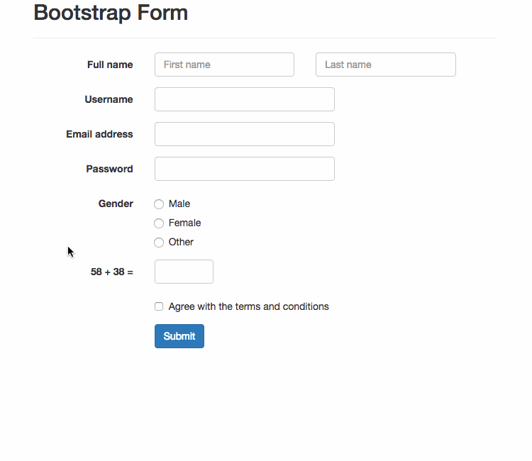
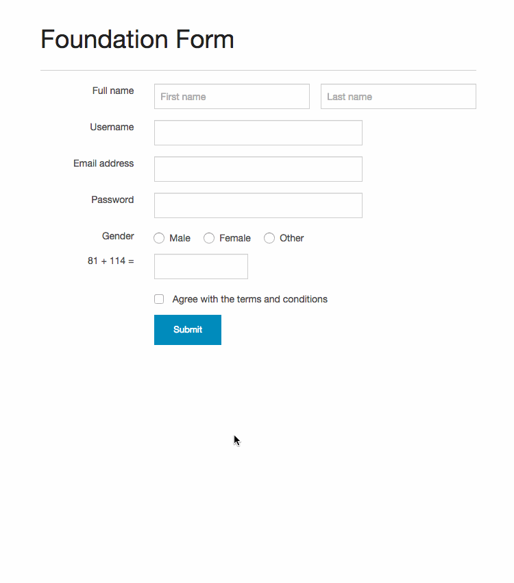
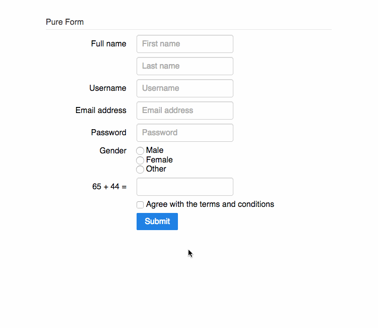
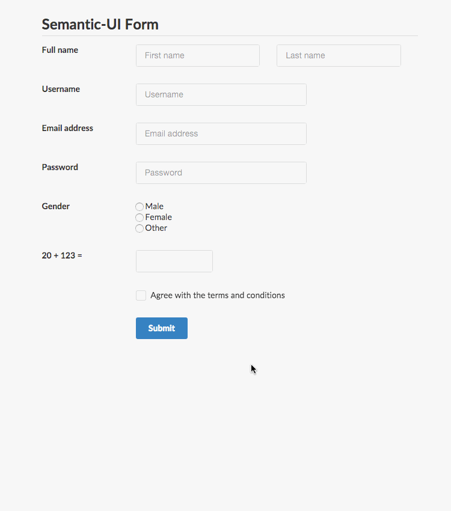
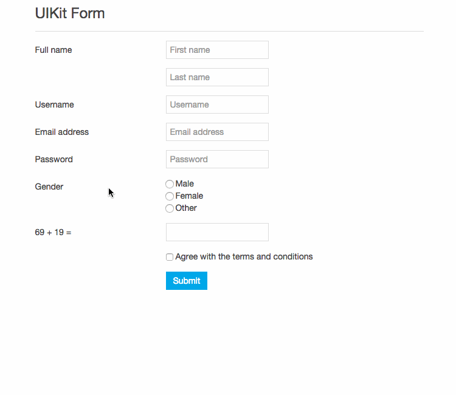

# FormValidation - [Download](http://formvalidation.io/download/)

| Quick links                                                                      |
|----------------------------------------------------------------------------------|
| [Document](http://formvalidation.io)                                             |
| [Examples](http://formvalidation.io/examples/)                                   |
| [Report issues, Ask questions](https://github.com/formvalidation/support/issues) |

[http://formvalidation.io](http://formvalidation.io) - The best [jQuery](http://jquery.com/) plugin to validate form fields, designed to use with:

- [x] [Bootstrap](http://getbootstrap.com/)
- [x] [Foundation](http://foundation.zurb.com/)
- [x] [Pure](http://purecss.io/)
- [x] [Semantic UI](http://semantic-ui.com/)
- [x] [UIKit](http://getuikit.com/)

It's developed from scratch by [@nghuuphuoc](http://twitter.com/nghuuphuoc).

__Required__: [jQuery 1.9.1+](http://jquery.com/)

Screenshots first because we love it!

__Validating Bootstrap form__



__Validating Foundation form__



__Validating Pure form__



__Validating Semantic UI form__



__Validating UI Kit form__



## Live demo

http://formvalidation.io/examples/

There are also many examples located in the [demo](demo) directory.

You also can run the ```demo``` locally by:

* Clone the repo: 

```
git clone https://github.com/formvalidation/formvalidation.git
```

* Go to the cloned directory and run the command: 

```
python -m SimpleHTTPServer 8000
```

* Access the demo at 

```
http://localhost:8000/demo/the_demo_file_here.html
```

## Features

See the [official website](http://formvalidation.io) for the full list of features

## Download

* Latest version: http://formvalidation.io/download/
* Release History: Look at the [Change Log](CHANGELOG.md)

## Documentation

* [Official website](http://formvalidation.io)

## Author

The __FormValidation__ plugin is written by Nguyen Huu Phuoc, aka @nghuuphuoc

* [http://twitter.com/nghuuphuoc](http://twitter.com/nghuuphuoc)
* [http://github.com/nghuuphuoc](http://github.com/nghuuphuoc)

## Contribution

Contributions are welcome!

Please notice that **your code** may be used as part of a **commercial product** if the pull request is **merged**.

## License

For more information about the license, see http://formvalidation.io/license/